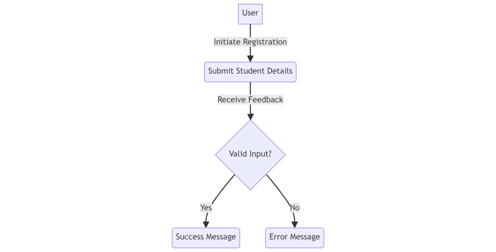

# Design Document: Student Registration System

## 1. Introduction

The Student Registration System is a server-side application designed to manage the registration of students for courses. This document outlines the architecture, key functionalities, and design decisions made during the development of the system.

## 2. Architecture

The system is built using Node.js as the server-side runtime, Express.js as the web application framework, and Mongoose as the MongoDB ODM (Object-Document Mapper) for database interaction.

### 2.1 Components

- **Node.js**: The JavaScript runtime for executing server-side code.
- **Express.js**: A minimal and flexible Node.js web application framework for building robust web applications.
- **Mongoose**: An ODM that provides a schema-based solution for modeling application data and interacting with MongoDB.

## 3. Database Design

### 3.1 MongoDB

The system utilizes a MongoDB database to store student details. The primary entity is the "Student," defined by the following schema:

```javascript
const mongoose = require("mongoose")

const StudentSchema = mongoose.Schema({
    name: String,
    age: Number,
    paymentStatus: Boolean,
    residence: String,
    cityAccessPermit: Boolean,
})

module.exports = mongoose.model("Student", StudentSchema)
```
The student schema includes fields for name, age, payment status, residence, city access permit, and course registration.

## 4. Application Flow
### 4.1 Input Handling
#### 4.1.1 API Endpoint
The application accepts student details through the /api/Student API endpoint using the HTTP POST method.

#### 4.1.2 Input Validation
The system performs validation to ensure that all required fields are present in the request body.

### 4.2 Data Processing and Validation
The application checks the eligibility of the student based on criteria such as course payment, age, residence, and city access permit.

### 4.3 Database Interaction
Student details are stored in the MongoDB database using Mongoose. Ineligible students are logged with appropriate error details.

### 4.4 User Feedback
The system provides feedback to the user, indicating success or failure based on the eligibility criteria and database interactions.

### 4.5 Sequence Diagram
The sequence diagram illustrates the high-level flow of the application when a student registers for a course.


### 4.6 User Flow Diagram
The user flow diagram details the steps a user takes to interact with the application, from initiating the registration to receiving feedback.


## 5. How-to Guide (Installation and Usage)
Refer to the separate "How-to Guide" document for detailed instructions on setting up, running, and using the application.

## 6. Conclusion
The Student Registration System is designed to be a robust, user-friendly application for managing student registrations. The use of Node.js, Express.js, and Mongoose provides a scalable and efficient solution for handling the specified requirements.

This document serves as a high-level overview of the design decisions made during the development process. Detailed implementation instructions can be found in the accompanying "How-to Guide" document.